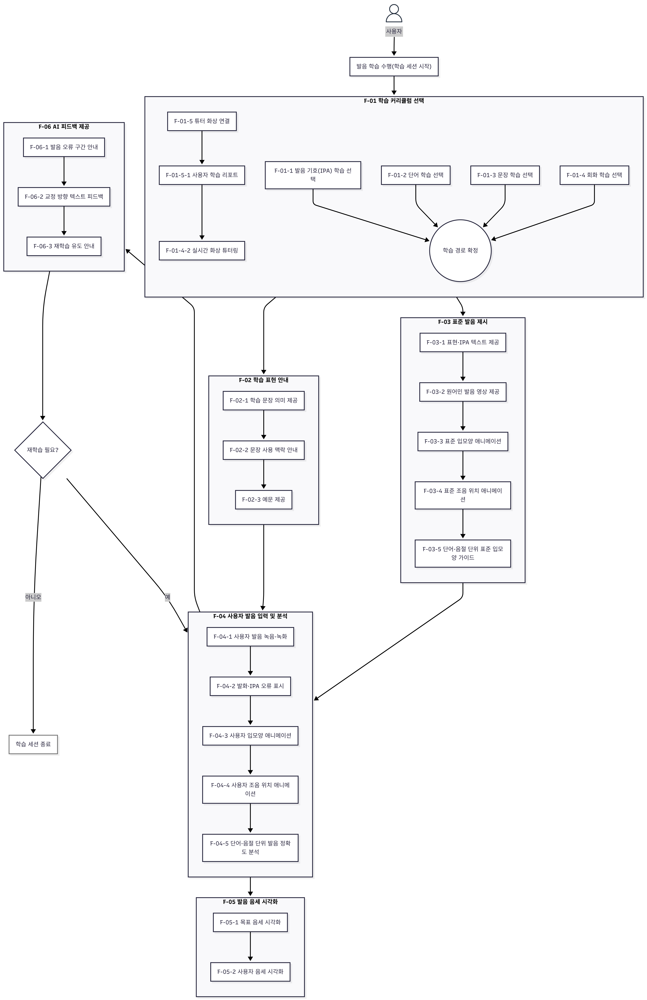

*Beyond Sound 팀의 **[바르미]** 서비스 공통 문서 레포지토리입니다.*

> 저희는 청각장애인을 위한 영어 발음 학습 서비스를 개발합니다.

## 🔀 서비스 기능 및 사용자 플로우 차트
<table>
<tr>
<td width="50%" valign="top">

```text
바르미
 ├─ [F-01] 학습 커리큘럼 선택 기능
 │   ├─ [F-01-1] 발음 기호(IPA) 학습 선택
 │   ├─ [F-01-2] 단어 학습 선택
 │   ├─ [F-01-3] 문장 학습 선택
 │   ├─ [F-01-4] 회화 학습 선택
 │   └─ [F-01-5] 튜터 화상 연결
 │      ├─ [F-01-5-1] 사용자 학습 리포트
 │      └─ [F-01-5-2] 실시간 화상 튜터링
 │
 ├─ [F-02] 학습 표현 안내 기능
 │   ├─ [F-02-1] 학습 문장 의미 제공
 │   ├─ [F-02-2] 문장 사용 맥락 안내
 │   └─ [F-02-3] 예문 제공
 │
 ├─ [F-03] 표준 발음 제시 기능
 │   ├─ [F-03-1] 학습 표현·발음 기호(IPA) 텍스트 제공
 │   ├─ [F-03-2] 원어민 발음 영상 제공
 │   ├─ [F-03-3] 표준 입모양 애니메이션
 │   ├─ [F-03-4] 표준 조음 위치 애니메이션
 │   └─ [F-03-5] 단어·음절 단위 표준 입모양 가이드
 │
 ├─ [F-04] 사용자 발음 입력 및 분석 기능
 │   ├─ [F-04-1] 사용자 발음 녹음·녹화
 │   ├─ [F-04-2] 사용자 발화 표현·발음 기호(IPA) 오류 표시
 │   ├─ [F-04-3] 사용자 입모양 애니메이션
 │   ├─ [F-04-4] 사용자 조음 위치 애니메이션
 │   └─ [F-04-5] 단어·음절 단위 발음 정확도 분석
 │
 ├─ [F-05] 발음 음세 시각화 기능
 │   ├─ [F-05-1] 목표 음세 시각화
 │   └─ [F-05-2] 사용자 음세 시각화
 │
 └─ [F-06] AI 피드백 제공 기능
     ├─ [F-06-1] 발음 오류 구간 안내
     ├─ [F-06-2] 교정 방향 텍스트 피드백
     └─ [F-06-3] 재학습 유도 안내
```
</td> <td width="45%" align="center" valign="top">  </td> </tr> </table>

## 📑 기술개발문서
- [학습 커리큘럼 설계](https://www.notion.so/2f4fc74069a680a586bfcf2cdac6da38?source=copy_link)

## 👥 협업 컨벤션 
### 📄 Git 협업
- [브랜치 → 커밋/PR WorkFlow](https://www.notion.so/PR-WorkFlow-2eafc74069a680c88429c9052440d470?source=copy_link)
- [Branch 전략](https://www.notion.so/Branch-2defc74069a6807e806be81f1e28627b?source=copy_link)
- [Git 커밋 컨벤션](https://www.notion.so/Git-2eafc74069a68056b085d7e44cefcef0?source=copy_link)
- [Pull Request 전략](https://www.notion.so/Pull-Request-2eafc74069a68007a9aedecce45cd6bc?source=copy_link)
### 📄 팀 협업
- [Jira 이슈 컨벤션](https://www.notion.so/Jira-2eafc74069a680cf9071c4e799523901?source=copy_link)
- [그라운드 룰](https://www.notion.so/2eafc74069a680ab86c0c0e398e371ab?source=copy_link)
- [기술 문서 작성 룰](https://www.notion.so/2eafc74069a6807ba7cff1feca1a83d1?source=copy_link)
